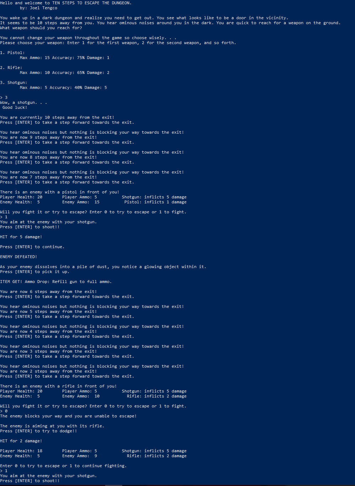

# f17-cs141-project2
"Escape the Dungeon Game" project for object oriented programming practice.

You wake up in a dark dungeon and realize you need to get out. You see what looks like to be a door in the vicinity. It seems to be 10
steps away from you. You hear ominous noises around you in the dark. You are quick to reach for a weapon on the ground. What weapon
should you reach for?

#### Running the program
Once in the bin folder, one can run the program with, assuming Java is isntalled properly:

`java -classpath . edu.cpp.cs.cs141.prog_assgmnt_2.Main`

Here is an example of the game:

